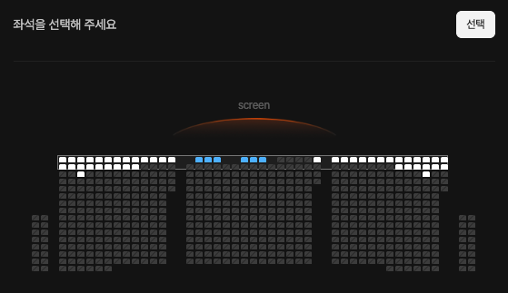
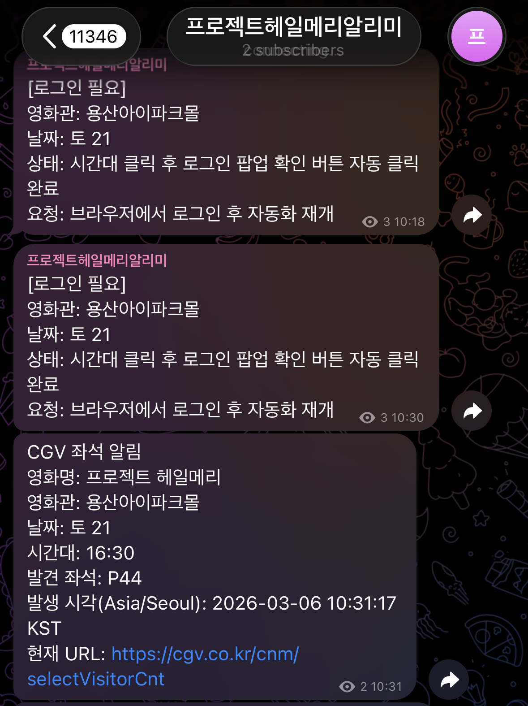

# 강의 개요

## 도입

2026년의 지금, AI를 활용하면 누구나 자신의 서비스를 훨씬 쉽게 만들 수 있는 시대가 되었습니다. 흔히 이런 흐름을 "바이브코딩"이라고 부르기도 합니다.

최근 저는 영화 `프로젝트 헤일메리`를 용산 아이맥스에서 보고 싶어 예매 페이지에 들어갔는데, 좌석이 거의 없는 상황을 보게 됐습니다.

그래서 직접 좌석 상황을 확인하고, 자리가 생기면 바로 알림을 주는 간단한 프로그램을 만들었습니다.

좌석이 생기면 텔레그램 메시지가 오도록 연결했습니다.

## AI로 개발할 수 있을까

예전에는 Java나 Python 같은 개발 언어를 배워야만 서비스를 만들 수 있다고 생각했습니다. 하지만 이제는 자연어, 즉 우리가 평소 사용하는 말로도 많은 부분을 구현할 수 있게 됐습니다.

그렇다고 해서 자연어만으로 완벽하게 개발할 수 있는 것은 아닙니다. 실제로는 다음과 같은 문제가 자주 발생합니다.

- 없는 라이브러리(개발 플러그인)를 있다고 설명하는 할루시네이션
- 에러를 끝까지 해결하지 못하고 같은 문제를 반복하는 상황
- 실행은 되지만 운영 단계에서 드러나는 성능 문제

즉, 개발 지식이 전혀 없는 상태에서 자연어만으로 원하는 서비스를 완성하는 것은 아직 어렵습니다.

## 그래서 이 강의를 준비했습니다

이 강의는 바이브코딩을 제대로 활용하기 위해 반드시 알아야 할 핵심 개념만 골라서 익히는 과정입니다.

- 웹페이지가 브라우저에 어떻게 보이는지 이해합니다. `HTML`
- 화면을 원하는 형태로 꾸미는 방법을 배웁니다. `CSS`
- 버튼을 누르면 왜 화면이 바뀌는지 이해합니다. `JavaScript`
- 화면에 보이는 데이터가 어디서 오고, 어떻게 주고받는지 배웁니다. `DB`, `HTTP 통신`

## 학습 대상

- 코딩을 처음 접하는 대학생

## 최종 목표

- React + Supabase 기반의 Todo List 프로젝트를 완성합니다.
- GitHub와 Vercel을 활용해 프로젝트를 배포합니다.
