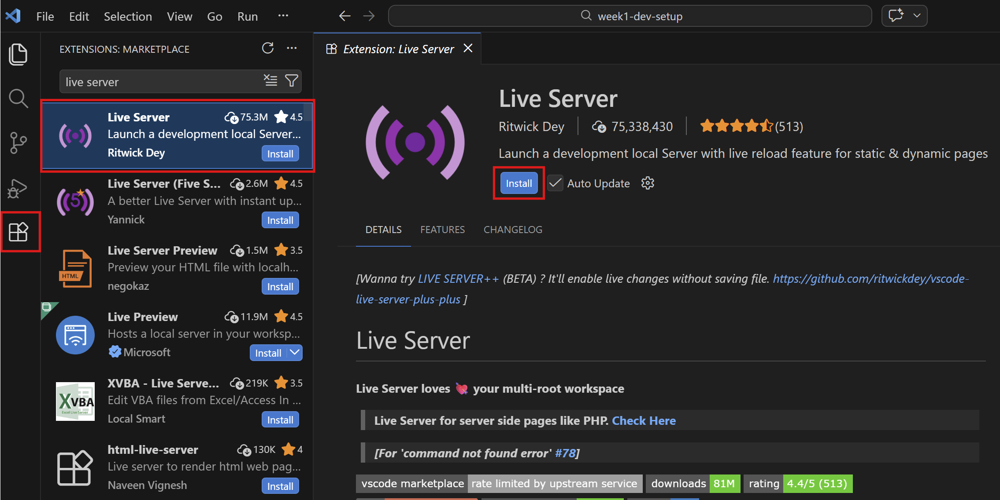
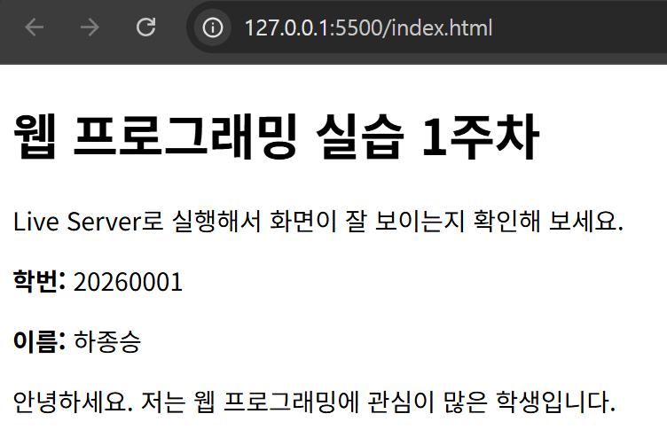

# 1주차 - 개발환경 세팅

## 이번 주 목표

- VS Code에서 프로젝트 폴더를 열 수 있다.
- `index.html` 파일을 만들고 실행할 수 있다.
- 저장과 새로고침의 관계를 이해할 수 있다.
- 브라우저 화면에 본인 정보가 보이도록 수정할 수 있다.

## 왜 이 실습을 하나요?

웹개발은 코드를 많이 외우는 것보다, 파일을 만들고 저장하고 실행하는 기본 흐름에 익숙해지는 것이 먼저입니다.
앞으로 HTML, CSS, JavaScript를 계속 수정해야 하므로 1주차에서는 "작성 → 저장 → 실행 → 확인"의 리듬을 만드는 것이 가장 중요합니다.

## 준비물

- VS Code
- Chrome 또는 Edge
- Live Server 확장

## Live Server 설치 방법

  

1. VS Code 왼쪽 메뉴에서 확장 아이콘을 누릅니다.
2. 검색창에 `Live Server`를 입력합니다.
3. 만든 사람이 `Ritwick Dey`인지 확인합니다.
4. 설치 후 `Go Live` 버튼이 보이는지 확인합니다.

## 이번 주 파일 설명

- `example/hello-html/index.html`: 가장 간단한 HTML 실행 예제입니다.
- `starter/html-playground/index.html`: 학생이 직접 수정하는 실습 파일입니다.

## 코드에서 꼭 볼 부분

- `<!DOCTYPE html>`: HTML5 문서임을 브라우저에 알려줍니다.
- `<html>`: HTML 문서 전체를 감싸는 태그입니다.
- `<head>`: 브라우저 설정 정보가 들어가는 영역입니다.
- `<body>`: 실제 화면에 보이는 내용이 들어가는 영역입니다.
- `<h1>`: 가장 큰 제목입니다.
- `
`: 문단입니다.

## 실습 순서

  

1. `hello-html/index.html` 파일을 엽니다.
2. 파일을 우측 클릭한 뒤, Open With Live Server를 선택합니다.
3. 문장을 한 줄 바꾼 뒤 저장합니다.
4. 화면이 자동으로 바뀌는지 확인합니다.
5. `html-playground/index.html`을 열어 본인 정보로 수정합니다.

## 학생 실습 미션

1. 제목을 본인 이름으로 바꿉니다.
2. 자기소개 한 줄을 작성합니다.
3. 오늘 배운 점을 문단으로 하나 더 추가합니다.
4. 브라우저에서 정상적으로 보이는지 확인합니다.

## 체크리스트

- [ ] Live Server 설치를 완료했다.
- [ ] 예제 HTML 파일을 브라우저에서 실행했다.
- [ ] starter 파일을 내 정보로 수정했다.
- [ ] 저장 후 화면이 바뀌는 것을 확인했다.

## 자주 하는 실수

- 저장하지 않아서 화면이 안 바뀌는 경우
- `index.html`이 아닌 다른 파일을 여는 경우
- `<body>` 바깥에 화면 내용을 작성하는 경우
- 태그를 열고 닫는 짝을 맞추지 않는 경우

## 한 줄 정리

1주차의 핵심은 "내가 만든 파일을 직접 실행하고 수정 결과를 바로 확인하는 습관"입니다.
